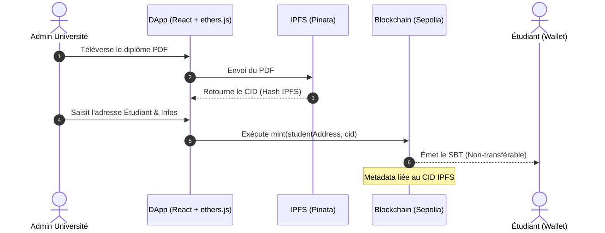

# AGENTS.md — Directives & Bonnes Pratiques pour le Projet SBT MBDS

Ce document définit les standards techniques, architecturaux, de sécurité et de collaboration pour tous les agents IA et développeurs travaillant sur le projet **Diplôme Soulbound (SBT) - Certification Académique Décentralisée**.

---

## 1. Vision & Architecture Globale

Le projet consiste en une application décentralisée (DApp) permettant à l'**IT University Madagascar** d'émettre des diplômes académiques infalsifiables sous forme de jetons non transférables (**Soulbound Tokens - SBT**).



---

## 2. Standards Solidity & Smart Contracts (`contracts/`)

### 2.1 Spécifications du Soulbound Token (SBT)
- **Standard de base** : Utiliser le standard `ERC721` d'**OpenZeppelin v5** (ou v4).
- **Règle d'or Soulbound** : Bloquer TOUS les transferts de jetons après émission.
  - *Avec OpenZeppelin v5* : Surcharger la fonction interne `_update` :
    ```solidity
    function _update(address to, uint256 tokenId, address auth) internal override returns (address) {
        address from = _ownerOf(tokenId);
        if (from != address(0) && to != address(0)) {
            revert TokenIsSoulbound();
        }
        return super._update(to, tokenId, auth);
    }
    ```
  - *Avec OpenZeppelin v4* : Surcharger `_beforeTokenTransfer` :
    ```solidity
    function _beforeTokenTransfer(address from, address to, uint256 tokenId, uint256 batchSize) internal override {
        super._beforeTokenTransfer(from, to, tokenId, batchSize);
        if (from != address(0) && to != address(0)) {
            revert TokenIsSoulbound();
        }
    }
    ```
- **Gestion des métadonnées** : Associer chaque `tokenId` à son **CID IPFS** (renvoyé par Pinata) et implémenter `tokenURI(uint256 tokenId)` pour retourner l'URL IPFS complète (ex: `ipfs://CID`).

### 2.2 Directives de Codage Solidity
- **Version du Compilateur** : Fixer la version exacte pour assurer la reproductibilité. Utiliser `pragma solidity 0.8.24;` (version stable récente). Éviter les pragmas flottants (`^0.8.0`).
- **Optimisation du Gas & Sécurité (Erreurs personnalisées)** : Remplacer les chaînes de caractères de `require` par des `error` personnalisées pour économiser du gas :
  ```solidity
  error OnlyUniversityAdmin();
  error TokenIsSoulbound();
  error InvalidIPFSHash();
  ```
- **Pattern CEI (Checks-Effects-Interactions)** : Toujours respecter ce pattern pour prévenir la réentrance :
  1. *Checks* : Vérifier les conditions (`require`, `revert`).
  2. *Effects* : Mettre à jour l'état interne (compteurs, variables d'état).
  3. *Interactions* : Effectuer des appels externes ou transferts d'Ether (`call`, `transfer`).
- **Documentation NatSpec** : Commenter obligatoirement le contrat avec le format standardisé d'Ethereum :
  ```solidity
  /// @title Certification Académique Soulbound (SBT)
  /// @notice Permet l'émission de diplômes non-transférables
  /// @dev Conforme ERC721 avec transferts bloqués
  ```

---

## 3. Standards d'Intégration Web3 (`front/`)

### 3.1 Connexion MetaMask
- **Gestion de l'état du Wallet** : Éviter les fuites de mémoire et les UIs désynchronisées. Utiliser des écouteurs d'événements pour le changement de compte ou de réseau :
  ```javascript
  window.ethereum.on('accountsChanged', (accounts) => {
      // Recharger l'état de l'application avec la nouvelle adresse
  });
  window.ethereum.on('chainChanged', () => {
      // Recharger la page pour éviter les conflits d'état sur différents réseaux
      window.location.reload();
  });
  ```
- **Vérification du réseau** : Bloquer les transactions si l'utilisateur n'est pas connecté sur le testnet **Sepolia (ID: 11155111)**. Proposer un basculement automatique de réseau.

### 3.2 Utilisation d'Ethers.js (v6 recommandé)
- **Séparation Provider / Signer** :
  - Utiliser un `BrowserProvider` public/lecture seule pour la barre de recherche publique de diplômes (pas besoin de MetaMask connecté).
  - Utiliser le `Signer` uniquement pour le tableau de bord Admin lors de l'appel à `mint`.
- **Gestion des types** : Toujours utiliser `BigInt` (natif JS et requis par ethers v6) pour les types `uint256` blockchain.

### 3.3 Intégration IPFS / Pinata
- **Sécurité Critique** : **Ne JAMAIS stocker les clés API Pinata (API Key / JWT) en dur dans le code front-end public !**
- **Bonne pratique** : Configurer un endpoint proxy serverless (ou une route API simple, ex: Next.js API route ou micro-serveur Express temporaire) pour téléverser les fichiers vers Pinata. Si le projet est un front statique pure, utiliser des variables d'environnement (`.env.local`) exclues du commit Git.

---

## 4. Stratégie de Tests Unitaires (`test/`)

Pour valider l'excellence et décrocher les points bonus, le contrat doit être couvert à 100% par des tests unitaires (via **Hardhat** ou **Foundry**).

### Tests obligatoires à implémenter :
1. **Test de Déploiement** : Vérifier que l'owner du contrat est bien l'adresse administrative de l'Université.
2. **Test de Mint (Émission)** :
   - Vérifier que seul l'owner peut appeler `mint()`.
   - Vérifier qu'un appel de `mint()` par une adresse tierce échoue avec l'erreur `OnlyUniversityAdmin`.
   - Vérifier que l'URI du token correspond bien au CID IPFS fourni.
3. **Test d'Invariance Soulbound (Critique)** :
   - Tenter un transfert via `transferFrom()` ou `safeTransferFrom()` et s'assurer que la transaction **revert** systématiquement avec l'erreur `TokenIsSoulbound`.
   - Vérifier que l'approbation (`approve()` et `setApprovalForAll()`) échoue également ou est inopérante.

---

## 5. Guide de Collaboration des Agents IA

Ce projet implique des agents spécialisés travaillant de concert. Voici leurs règles d'engagement :

### 5.1 Rôles des Agents & Responsabilités
- **Agent Dev 1 (Nomena - Smart Contract)** : Garanti de la sécurité et du déploiement. Il doit valider les contrats via `npx hardhat compile` ou `forge build` et écrire les tests unitaires.
- **Agent Dev 2 (Mahery - Intégration Web3)** : Garanti du câblage. Il doit s'assurer que le fichier `config.ts` contient la dernière ABI et adresse du contrat Sepolia après chaque déploiement.
- **Agent Dev 3 (Ny Avo - IPFS)** : Garanti du stockage. Il doit s'assurer de la bonne structure des métadonnées (Metadata standard d'OpenZeppelin : `name`, `description`, `image`, `attributes`).
- **Agent Designers (Kanto & Francko - Front-end)** : Garants de l'esthétique et de l'expérience utilisateur. Ils doivent concevoir une UI responsive, vivante (hover effects, animations discrètes) et soignée (mode sombre élégant).

### 5.2 Flux de Synchronisation Technique
Chaque fois qu'un contrat est modifié :
1. **Dev 1** compile et extrait la nouvelle **ABI** (JSON).
2. **Dev 1** déploie sur Sepolia et récupère la **nouvelle adresse** du contrat.
3. **Dev 1** ou **Dev 2** met à jour le fichier `front/src/config.ts` avec la nouvelle adresse et l'ABI mise à jour.
4. **Dev 2** teste la connexion avec MetaMask et la lecture/écriture.
